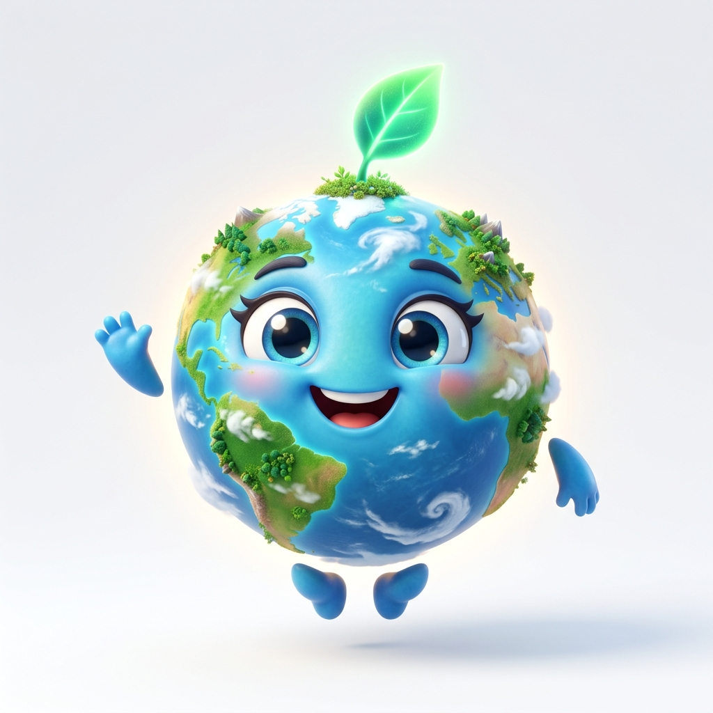

# 🌿 SYLVA — Heal the Planet. One Habit at a Time.

<p align="center">
  
</p>

<p align="center">
  <strong>An AI-powered, gamified sustainability platform transforming climate awareness into actionable daily habits through real-time 3D planetary visualization and intelligent environmental mentorship.</strong>
</p>

<p align="center">
  <a href="#-key-features"></a>
  <a href="#-key-features"></a>
  <a href="#-key-features"></a>
  <a href="#-key-features"></a>
  <a href="#-key-features"></a>
  <a href="#-key-features"></a>
  <a href="#-key-features"></a>
</p>

---

## 📖 Table of Contents

- [Overview](#-overview)
- [Key Features](#-key-features)
  - [1. Real-Time 3D Living Earth Simulator](#1-real-time-3d-living-earth-simulator)
  - [2. Gaia AI & Intelligent Eco-Mentorship](#2-gaia-ai--intelligent-eco-mentorship)
  - [3. Procedural Virtual Life Tree](#3-procedural-virtual-life-tree)
  - [4. 3D Floating Eco Sanctuary (Island)](#4-3d-floating-eco-sanctuary-island)
  - [5. The Eco Games Arcade (6 Interactive Mini-Games)](#5-the-eco-games-arcade-6-interactive-mini-games)
  - [6. AI Recycling & Smart Waste Scanner](#6-ai-recycling--smart-waste-scanner)
  - [7. Carbon Footprint Analytics & Reporting](#7-carbon-footprint-analytics--reporting)
  - [8. Gamification Engine: XP, Ranks & Inventory](#8-gamification-engine-xp-ranks--inventory)
- [Tech Stack & Architecture](#-tech-stack--architecture)
- [Project Directory Structure](#-project-directory-structure)
- [Getting Started](#-getting-started)
  - [Prerequisites](#prerequisites)
  - [Installation](#installation)
  - [Environment Configuration](#environment-configuration)
  - [Running the Application](#running-the-application)
- [Gamification Mechanics & Progression](#-gamification-mechanics--progression)
- [Contributing](#-contributing)
- [License](#-license)

---

## 🌍 Overview

Most environmental platforms overwhelm users with doom-and-gloom statistics without providing direct, rewarding feedback loops. **SYLVA** flips this paradigm on its head by merging **immersive 3D WebGL graphics**, **generative artificial intelligence (Google Gemini 2.5)**, and **game design principles** to make sustainable living intuitive, interactive, and deeply rewarding.

Every conscious decision you log—from skipping single-use plastics to choosing low-carbon transit—directly restores an interactive 3D model of Earth, nurtures your personal Life Tree, advances your Eco Sanctuary island, and levels up your planetary rank.

---

## ✨ Key Features

### 1. Real-Time 3D Living Earth Simulator
- **Interactive WebGL Globe**: Rendered via **Three.js** and **@react-three/fiber**, responding smoothly to camera rotation, zoom, and touch inputs.
- **Dynamic Planetary Biome Health**:
  - **Planet Pulse**: Global vitality score calculated from your aggregated daily habits.
  - **Forest Vitality**: Reflects plant-based dietary shifts and reforestation actions.
  - **Ocean Health**: Tracks reductions in single-use plastics and ocean cleanup efforts.
  - **Air Quality**: Dynamically dims or clarifies atmospheric pollution cloud shaders based on transit choices.
  - **Biodiversity**: Visual representation of species preservation and habitat support.

### 2. Gaia AI & Intelligent Eco-Mentorship
- **3D Animated Companion**: Gaia floats alongside your dashboard with real-time reactive emotions (`idle`, `happy`, `sleeping`, `celebrating`, `concerned`).
- **Encouragement Engine**: Powered by `@google/genai` with `gemini-2.5`, analyzing user onboarding answers and everyday habit choices to provide tailored, empathetic, non-judgmental guidance.
- **Contextual Environmental Prompts**: Dynamically alerts users when daily streaks are about to lapse or when global events require collective action.

### 3. Procedural Virtual Life Tree
- A dedicated 3D interactive tree model that procedurally evolves and branches out as users earn XP.
- Higher levels unlock magical particle sparkles, vibrant foliage shades, and floating orbital energies.

### 4. 3D Floating Eco Sanctuary (Island)
- A personal digital ecosystem rendered in full 3D.
- Place unlocked items, renewable energy generators, wildlife habitats, and clean-tech infrastructure earned from completed missions.

### 5. The Eco Games Arcade (6 Interactive Mini-Games)
A suite of arcade games designed to educate and entertain while reinforcing sustainable behaviors:
1. **City Builder**: Strategically balance urban growth, clean energy, waste management, and green parks.
2. **Waste Sorting**: Fast-paced game testing your reflexes and knowledge on recyclables, compostables, and hazardous items.
3. **Energy Defender**: Balance fluctuating renewable power grids (solar, wind, hydro) against demand surges.
4. **Forest Guardian**: Protect native forests from wild threats, plant saplings, and maintain biodiversity balance.
5. **River Rescue**: Navigate waterways to clean debris, prevent pollution runoff, and save aquatic species.
6. **Eco Quiz**: Daily trivia challenges covering climate science, ecology, and zero-waste hacks.

### 6. AI Recycling & Smart Waste Scanner
- Conversational AI waste disposal assistant powered by Google Gemini.
- Ask questions or describe complex materials to receive instant, punchy recommendations for sorting, recycling, composting, or upcycling.

### 7. Carbon Footprint Analytics & Reporting
- Visual trend analysis powered by **Recharts** displaying monthly CO₂ reductions and historical milestones.
- Granular breakdown across four primary carbon sectors: **Transport**, **Energy**, **Food**, and **Waste**.
- Exportable environmental progress summaries.

### 8. Gamification Engine: XP, Ranks & Inventory
- **Missions & Streaks**: Daily action checklists with streak multipliers to build long-term positive habits.
- **Dual-Currency Economy**: Earn **Green Coins** and **Gems** to spend in the Eco Store.
- **Tiered Player Titles**:
  $$\text{Seed} \longrightarrow \text{Sprout} \longrightarrow \text{Eco Explorer} \longrightarrow \text{Guardian} \longrightarrow \text{Forest Hero} \longrightarrow \text{Planet Protector} \longrightarrow \text{Earth Legend}$$
- **Collectible Inventory**: Collectable badges, placeable island artifacts, and reward celebration modals.

---

## 🛠 Tech Stack & Architecture

| Layer | Technologies |
| :--- | :--- |
| **Framework** | [Next.js 16 (App Router)](https://nextjs.org/) |
| **Language & Runtime** | [React 19](https://react.dev/), [TypeScript 5](https://www.typescriptlang.org/) |
| **3D & Graphics** | [Three.js](https://threejs.org/), [@react-three/fiber](https://docs.pmnd.rs/react-three-fiber), [@react-three/drei](https://github.com/pmndrs/drei), GLSL Shaders |
| **Styling & UI** | [Tailwind CSS v4](https://tailwindcss.com/), [Framer Motion](https://www.framer.com/motion/), [GSAP](https://greensock.com/gsap/), [Lucide React](https://lucide.dev/) |
| **State Management** | [Zustand](https://github.com/pmndrs/zustand) |
| **Artificial Intelligence** | [Google GenAI SDK (@google/genai)](https://www.npmjs.com/package/@google/genai) — **Gemini 2.5** |
| **Backend & Database** | [Firebase Authentication](https://firebase.google.com/products/auth), [Cloud Firestore](https://firebase.google.com/products/firestore) |
| **Data Visualization** | [Recharts](https://recharts.org/) |
| **Forms & Validation** | [React Hook Form](https://react-hook-form.com/), [Zod](https://zod.dev/) |

---

## 📂 Project Directory Structure

```plaintext
sylva/
├── public/
│   └── assets/                     # 3D models (.glb), textures, and branding images
│       ├── earth_cartoon.glb       # Low-poly stylized Earth asset
│       ├── gaia.png                # Gaia AI avatar
│       ├── island.png              # Sanctuary island asset
│       └── chest.png               # Reward chest graphics
├── src/
│   ├── app/                        # Next.js App Router routes & layouts
│   │   ├── (auth)/                 # Authentication views (Login, Register)
│   │   ├── dashboard/              # Protected dashboard modules
│   │   │   ├── achievements/       # Badge showcase & milestones
│   │   │   ├── challenges/         # Community & seasonal challenges
│   │   │   ├── community/          # Social impact feeds & global targets
│   │   │   ├── earth/              # Full-screen 3D Living Earth exploration
│   │   │   ├── games/              # 6 interactive sustainability mini-games
│   │   │   ├── inventory/          # User cosmetics & placeable sanctuary items
│   │   │   ├── island/             # 3D interactive floating Eco Island
│   │   │   ├── leaderboard/        # Global & regional player standings
│   │   │   ├── profile/            # User Eco DNA & account settings
│   │   │   ├── recycling/          # Gemini-powered AI waste sorting advisor
│   │   │   ├── report/             # Carbon emission reduction analytics
│   │   │   ├── settings/           # Audio, graphics, and theme preferences
│   │   │   └── tree/               # 3D Virtual Life Tree procedural viewer
│   │   ├── onboarding/             # Interactive Eco DNA discovery quiz
│   │   ├── globals.css             # Tailwind CSS v4 styling & custom tokens
│   │   ├── layout.tsx              # Root HTML & Providers wrapper
│   │   └── page.tsx                # High-conversion 3D landing page
│   ├── components/                 # Reusable UI & 3D canvas components
│   │   ├── canvas/                 # React Three Fiber canvas controllers & shaders
│   │   ├── dashboard/              # TopNav, Sidebar, Gaia AI companion, widgets
│   │   ├── games/                  # Shared game UI & reward modals
│   │   ├── inventory/              # Inventory card grids & item inspect
│   │   ├── sections/               # Landing page presentation blocks
│   │   └── ui/                     # Preloader, buttons, modal primitives
│   ├── lib/                        # Business logic, API clients & DB helpers
│   │   ├── actions/
│   │   │   └── gemini.ts           # Server Actions connecting to Google Gemini AI
│   │   ├── db.ts                   # Firestore profiles, items, and inventory schema
│   │   ├── firebase.ts             # Firebase app initialization
│   │   └── utils.ts                # Tailwind class merger utilities
│   ├── shaders/                    # Custom WebGL fragment and vertex shaders
│   └── store/                      # Zustand global state
│       └── useEarthStore.ts        # Central state: health metrics, XP, streak, Gaia
├── .env.example                    # Sample environment variables
├── next.config.ts                  # Next.js build configuration
├── package.json                    # Project dependencies & scripts
├── tailwind.config.ts / postcss    # Tailwind styling configuration
└── tsconfig.json                   # TypeScript configuration
```

---

## 🚀 Getting Started

### Prerequisites

Ensure you have the following installed on your local development machine:
- **Node.js**: v18.18.0 or newer (v20+ recommended)
- **Package Manager**: `npm`, `pnpm`, `yarn`, or `bun`
- A free **Google AI Studio** API key (for Gemini)
- A **Firebase** project with Authentication and Firestore enabled

### Installation

1. **Clone the Repository**:
   ```bash
   git clone https://github.com/Ghost2277-cmyk/Test_pixxel_hacck.git
   cd Test_pixxel_hacck
   ```

2. **Install Dependencies**:
   ```bash
   npm install
   # or
   pnpm install
   # or
   yarn install
   ```

### Environment Configuration

Create a `.env.local` file in the root directory by copying the provided `.env.example`:

```bash
cp .env.example .env.local
```

Populate the keys with your credentials:

```ini
# Google Gemini API Key (Required for AI features)
GEMINI_API_KEY=AIzaSyYourGeminiApiKeyHere

# Firebase Client Configuration (Required for Auth & Cloud Persistence)
NEXT_PUBLIC_FIREBASE_API_KEY=AIzaSyYourFirebaseApiKey
NEXT_PUBLIC_FIREBASE_AUTH_DOMAIN=your-app.firebaseapp.com
NEXT_PUBLIC_FIREBASE_PROJECT_ID=your-app
NEXT_PUBLIC_FIREBASE_STORAGE_BUCKET=your-app.firebasestorage.app
NEXT_PUBLIC_FIREBASE_MESSAGING_SENDER_ID=123456789012
NEXT_PUBLIC_FIREBASE_APP_ID=1:123456789012:web:abcdef123456
NEXT_PUBLIC_FIREBASE_MEASUREMENT_ID=G-XXXXXXXXXX
```

> **Note**: If `GEMINI_API_KEY` is not provided, the application includes automatic fallback responses for local development.

### Running the Application

Start the local development server:

```bash
npm run dev
```

Open your browser and navigate to:
```
http://localhost:3000
```

To create an optimized production build:
```bash
npm run build
npm run start
```

---

## 🎮 Gamification Mechanics & Progression

| Rank | XP Range | Unlocks |
| :--- | :--- | :--- |
| 🌱 **Seed** | 0 – 100 XP | Onboarding quests, Basic Life Tree sprout |
| 🌿 **Sprout** | 101 – 250 XP | Waste Sorting mini-game, Tier-1 Sanctuary items |
| 🧭 **Eco Explorer** | 251 – 500 XP | Energy Defender game, Custom tree foliage colors |
| 🛡️ **Guardian** | 501 – 850 XP | Forest Guardian & River Rescue mini-games |
| 🌲 **Forest Hero** | 851 – 1,300 XP | Life Tree golden glow & particle aura |
| 🪐 **Planet Protector** | 1,301 – 2,000 XP | City Builder sandbox & rare sanctuary structures |
| ⭐ **Earth Legend** | 2,000+ XP | Floating celestial orbs, Legendary title & badges |

---

## 🤝 Contributing

Contributions to SYLVA are warmly welcomed! Whether you are fixing bugs, optimizing 3D WebGL performance, expanding AI prompts, or designing new games:

1. **Fork the Repository**
2. **Create your Feature Branch**:
   ```bash
   git checkout -b feature/eco-feature-name
   ```
3. **Commit your Changes**:
   ```bash
   git commit -m "feat: add innovative eco-feature"
   ```
4. **Push to the Branch**:
   ```bash
   git push origin feature/eco-feature-name
   ```
5. **Open a Pull Request**

---

## 📄 License

This project is licensed under the [MIT License](LICENSE).

---

<p align="center">
  Built with 💚 for the planet. Together, we can restore the Earth.
</p>
